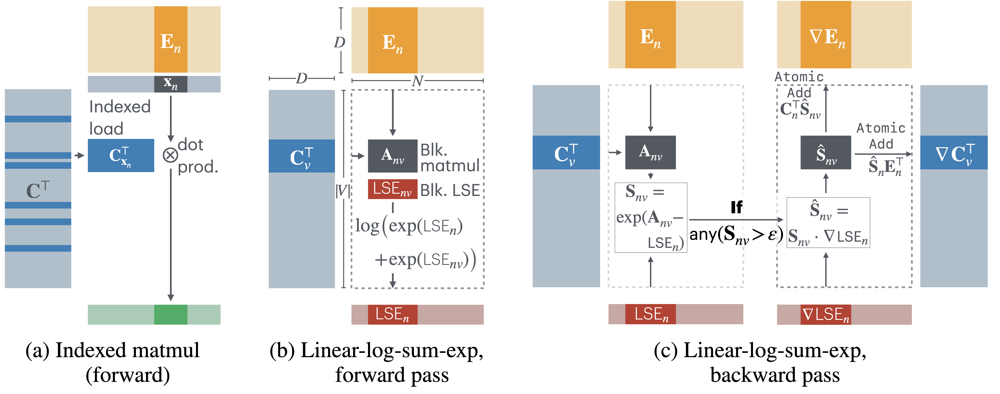

## Cut Your Losses in Large-Vocabulary Language Models

This software project accompanies the research paper:
**[Cut Your Losses in Large-Vocabulary Language Models](https://arxiv.org/abs/2411.09009)**,
*Erik Wijmans, Brody Huval, Alexander Hertzberg, Vladlen Koltun, and Philipp Krähenbühl*.



As language models grow ever larger, so do their vocabularies. This has shifted the memory footprint of LLMs during training disproportionately to one single layer: the cross-entropy in the loss computation. Cross-entropy builds up a logit matrix with entries for each pair of input tokens and vocabulary items and, for small models, consumes an order of magnitude more memory than the rest of the LLM combined. We propose Cut Cross-Entropy (CCE), a method that computes the cross-entropy loss without materializing the logits for all tokens into global memory. Rather, CCE only computes the logit for the correct token and evaluates the log-sum-exp over all logits on the fly. We implement a custom kernel that performs the matrix multiplications and the log-sum-exp reduction over the vocabulary in flash memory, making global memory consumption for the cross-entropy computation negligible. This has a dramatic effect. Taking the Gemma 2 (2B) model as an example, CCE reduces the memory footprint of the loss computation from 24 GB to 1 MB, and the total training-time memory consumption of the classifier head from 28 GB to 1 GB. To improve the throughput of CCE, we leverage the inherent sparsity of softmax and propose to skip elements of the gradient computation that have a negligible (i.e., below numerical precision) contribution to the gradient. Experiments demonstrate that the dramatic reduction in memory consumption is accomplished without sacrificing training speed or convergence.

## Getting started

**Requirements**

1. Python 3.10+
2. PyTorch 2.4+
3. Triton 3.0+
4. Ampere (or newer) GPU


**Note:**  For operating systems that are not supported by Triton (e.g., MacOS), we include a highly optimized version of
linear-cross-entropy using `torch.compile`. This implementation will be set to the default on MacOS.

### Basic usage

**Installation**
```bash
pip install "cut-cross-entropy @ git+https://github.com/apple/ml-cross-entropy.git"
```

**Usage**

```python
from cut_cross_entropy import linear_cross_entropy

embeddings = model.compute_embedding(inputs)
classifier = model.get_classifier_weights()

loss = linear_cross_entropy(embeddings, classifier, labels)
```

In causal language modeling, it is common that the model embeddings and labels need to be shifted
such that the model predicts the next token.

```python
from cut_cross_entropy import linear_cross_entropy

embeddings = model.compute_embedding(inputs)
classifier = model.get_classifier_weights()

shift_embeddings = embeddings[..., :-1, :].flatten(0, -2)
shift_labels = labels[..., 1:]

manual_shift_loss = linear_cross_entropy(shift_embeddings, classifier, shift_labels)
```

Instead, pass `shift=True` to perform this computation without allocating the shift_embeddings matrix.
```python
from cut_cross_entropy import linear_cross_entropy

embeddings = model.compute_embedding(inputs)
classifier = model.get_classifier_weights()

# This is the same as manual_shift_loss above
auto_shift_loss = linear_cross_entropy(embeddings, classifier, labels, shift=True)
```

We also provide a highly optimized implementation of linear-cross-entropy loss using `torch.compile`.
This is a good option
for scenarios where speed is the primary goal and the model has a relatively small vocabulary compared to its
hidden dimension (when |V| >> D, `cce` will both save memory _and_ be faster).
This option also works on the CPU and older GPUs, making it useful for testing.

```python
from cut_cross_entropy import linear_cross_entropy

embeddings = model.compute_embedding(inputs)
classifier = model.get_classifier_weights()

loss = linear_cross_entropy(embeddings, classifier, labels, ..., impl="torch_compile")
```

### Transformers Integration

**Installation**

Install cut-cross-entropy with transformers dependencies
```bash
pip install "cut-cross-entropy[transformers] @ git+https://github.com/apple/ml-cross-entropy.git"
```

**Usage**

If you are using transformers, you can patch transformers to use CCE directly. Note that
logits will no longer be returned (`None` will be returned instead).
```python
from cut_cross_entropy.transformers import cce_patch

cce_patch("llama")

# or

model = ...
model = cce_patch(model)
```

We currently support the Llama, Phi3, Mistral, and Gemma2 families of models.

`cce_patch` takes two options. The first is the linear-cross-entropy implementation to use. Currently `"cce"` or `"torch_compile"`.

The second
is the loss reduction. We support `"mean"`, `"sum"`, and `"none"`, that mirror their PyTorch counterpart.
`"mean"` is the default and what the transformers trainer API expects.
However,
`"none"` in particular can enable for efficient computation of quantities based on the loss.

For example, the following efficiently computes the perplexity of a batch of sequences:
```python
import transformers

from cut_cross_entropy.transformers import cce_patch


model = transformers.AutoModelForCausalLM.from_pretrained(...)

model = cce_patch(model, reduction="none")

labels = input_ids.clone()
labels[~attention_mask] = -100 # -100 is the ignore index for PyTorch and CCE.

outputs = model(input_ids, attention_mask, labels=labels)

loss = outputs[0] # A (B, T - 1) tensor because reduction="none". T - 1 because the first input token has
# no loss.

ppl = torch.exp(
    # [:, 1:] because the first token has no loss
    loss.sum(1) / (labels[:, 1:] != -100).count_nonzero(dim=1)
).mean()  # Average perplexity over the batch
```


### Training and reproducing the benchmark results

We provide a training in `training/train.py`.

**Installation**
```bash
pip install "cut-cross-entropy[all] @ git+https://github.com/apple/ml-cross-entropy.git"
```

**Training**

Use `scripts/train.sh` to train a full model.

**Benchmarking**

The benchmark script can be run via `python -m benchmark`.

Expected output with A100 SMX4, PyTorch 2.4.1, and CUDA 12.4.

```
          method        kind  runtime_ms  op_mem_mb test_data
0            cce     loss-fw        46.4        1.1    gemma2
1  torch_compile     loss-fw        49.9     4000.1    gemma2
2       baseline     loss-fw        81.9    24000.0    gemma2
3            cce     loss-bw        89.3     1163.0    gemma2
4  torch_compile     loss-bw        92.3    12000.0    gemma2
5       baseline     loss-bw       122.4    16000.0    gemma2
6            cce  loss-fw-bw       134.8     1164.0    gemma2
7  torch_compile  loss-fw-bw       144.0    16000.1    gemma2
8       baseline  loss-fw-bw       208.8    28000.0    gemma2
```

### Development

If dependencies are installed locally, `cut-cross-entropy` will work without a pip install as long as `python` is executed in the root path of the github repo.

To install directly from the github repo, either use an (editable) install or manipulate PYTHONPATH, e.g.

```bash
pip install -e ".[dev]"

# or
pip install ".[dev]"

# or
export PYTHONPATH=/path/to/ml-cross-entropy:${PYTHONPATH}
```

## Citation

```
@article{wijmans2024cut,
  author       = {Erik Wijmans and
                  Brody Huval and
                  Alexander Hertzberg and
                  Vladlen Koltun and
                  Philipp Kr\"ahenb\"uhl},
  title        = {Cut Your Losses in Large-Vocabulary Language Models},
  journal      = {arXiv},
  year         = {2024},
  url          = {https://arxiv.org/abs/2411.09009},
}
```


## License
This sample code is released under the [LICENSE](LICENSE) terms.

## Acknowledgements

Our codebase is built using multiple opensource contributions, please see [Acknowledgements](ACKNOWLEDGEMENTS.md) for more details.

Please check the paper for a complete list of references and datasets used in this work.
